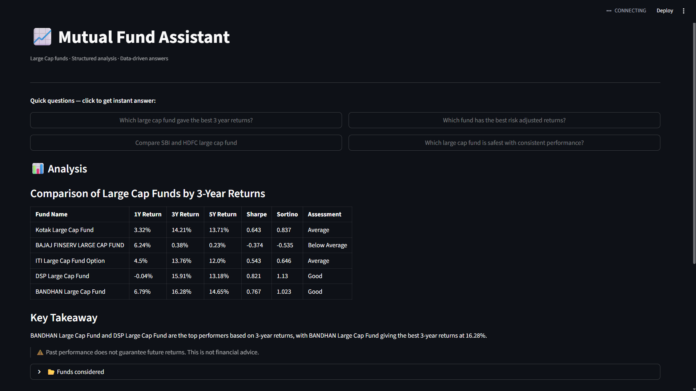

# 📈 NavIQ — Mutual Fund RAG Chatbot
## NAV (Net Asset Value) + IQ (Intelligence) — bringing intelligent analysis to mutual fund data.

A production-style AI application that answers natural language questions about Indian Large Cap mutual funds using real AMFI data, semantic search, and LLaMA 3.3 — containerised with Docker, orchestrated with Kubernetes, and automated with GitHub Actions CI/CD.

> Ask *"Which large cap fund gave the best 3-year returns?"* and get a structured, data-backed comparison table instantly.

---

## 🖥️ Demo



---

## 🏗️ Architecture

```
AMFI API ──────────────────────────────────────────┐
(Master fund list)                                  ▼
                                         fetch_schemes.py
mfapi.in ──────────────────────────────────────────┐
(5Y Historical NAV)                                 ▼
                                           fetch_nav.py
                                                    │
                                                    ▼
                                       compute_metrics.py
                                    (CAGR · Sharpe · Sortino)
                                                    │
                                                    ▼
                                         build_chunks.py
                                      (1 text doc per fund)
                                                    │
                                                    ▼
                                         embed_chunks.py
                                  (HuggingFace all-MiniLM-L6-v2)
                                                    │
                                                    ▼
                                     ┌──────────────────────────┐
                                     │       ChromaDB           │
                                     │   (Vector store —        │
                                     │  separate container)     │
                                     └──────────────────────────┘
                                                    │
                              User Query ───────────┘
                                                    │
                                                    ▼
                                            retriever.py
                                         (Top-5 similar funds)
                                                    │
                                                    ▼
                                               llm.py
                                    (LLaMA 3.3 70B via Groq)
                                                    │
                                                    ▼
                                          Streamlit UI (app.py)

━━━━━━━━━━━━━━━━━━━━━━━━━━━━━━━━━━━━━━━━━━━━━━━━━━━━━━━━

                         MLOps Layer

Developer pushes code
        │
        ▼
GitHub Actions CI/CD
        ├── Build Docker image
        └── Push to Docker Hub
                │
        ┌───────┴────────┐
        ▼                ▼
  Docker Compose    Kubernetes
  (local dev)       (production)
  app container     naviq Deployment
       │                 │
       ▼                 ▼
  chromadb          ChromaDB
  container         StatefulSet + PVC
```

---

## ✨ Features

- **Real financial data** — live NAV from AMFI, 5 years of history from mfapi.in
- **Quantitative metrics** — CAGR (1Y/3Y/5Y), Sharpe Ratio, Sortino Ratio per fund
- **Semantic search** — finds relevant funds even for vague or natural language queries
- **Structured answers** — LLM outputs comparison tables, not paragraphs
- **Microservices architecture** — app and ChromaDB run as separate containers
- **Production ready** — Kubernetes manifests with persistent storage and secrets management
- **Automated pipeline** — GitHub Actions builds and pushes Docker image on every commit

---

## 🛠️ Tech Stack

| Layer | Technology |
|---|---|
| Data ingestion | Python · Requests · Pandas |
| Metric computation | NumPy · Pandas |
| Embeddings | HuggingFace `all-MiniLM-L6-v2` |
| Vector store | ChromaDB (HTTP server mode) |
| LLM | LLaMA 3.3 70B via Groq API (free) |
| UI | Streamlit |
| Containerisation | Docker |
| Local orchestration | Docker Compose |
| Production orchestration | Kubernetes |
| CI/CD | GitHub Actions |
| Image registry | Docker Hub |

---

## 📁 Project Structure

```
NavIQ/
├── .github/
│   └── workflows/
│       └── ci.yaml                  # GitHub Actions CI/CD pipeline
├── assets/
│   └── demo.png                     # App screenshot
├── data/
│   ├── fetch_schemes.py             # Downloads AMFI fund list
│   ├── fetch_nav.py                 # Downloads 5Y NAV from mfapi.in
│   ├── scheme_list.csv              # ~36 Large Cap funds
│   ├── nav_history.parquet          # ~32,000 rows of daily NAV
│   ├── fund_metrics.csv             # Computed CAGR, Sharpe, Sortino
│   └── chunks.jsonl                 # One text document per fund
├── kubernetes/
│   ├── secret.yaml                  # Groq API key (base64)
│   ├── configmap.yaml               # Non-sensitive environment config
│   ├── chromadb-pvc.yaml            # Persistent storage for ChromaDB
│   ├── chromadb-statefulset.yaml    # ChromaDB as StatefulSet
│   ├── chromadb-service.yaml        # Internal service for ChromaDB
│   ├── deployment.yaml              # Streamlit app Deployment
│   └── app-service.yaml             # NodePort service to expose app
├── processing/
│   ├── compute_metrics.py           # CAGR, Sharpe, Sortino calculation
│   └── build_chunks.py              # Converts metrics to RAG text chunks
├── rag/
│   ├── embed_chunks.py              # Embeds chunks → stores in ChromaDB
│   ├── retriever.py                 # Semantic search over ChromaDB
│   └── llm.py                       # Groq LLM call + prompt engineering
├── app.py                           # Streamlit UI
├── Dockerfile                       # App container definition
├── docker-compose.yml               # Multi-container local setup
├── requirements.txt
├── .env.example
└── .gitignore
```

---

## 🚀 Running Locally

### Option A — Without Docker (plain Python)

```bash
# 1. Clone and setup
git clone https://github.com/YashRM27/NavIQ.git
cd NavIQ
python -m venv venv
source venv/Scripts/activate      # Windows
pip install -r requirements.txt

# 2. Add environment variables
cp .env.example .env
# Edit .env — add GROQ_API_KEY, set CHROMA_HOST=localhost, CHROMA_PORT=8000

# 3. Run data pipeline (one time)
python data/fetch_schemes.py
python data/fetch_nav.py
python processing/compute_metrics.py
python processing/build_chunks.py
python rag/embed_chunks.py

# 4. Launch app
streamlit run app.py
```

### Option B — With Docker Compose (recommended)

```bash
# 1. Clone and setup
git clone https://github.com/YashRM27/NavIQ.git
cd NavIQ
cp .env.example .env
# Edit .env — add GROQ_API_KEY

# 2. Start both containers
docker compose up --build

# 3. Embed fund data into ChromaDB (first time only)
docker compose exec app python rag/embed_chunks.py

# 4. Open app
# http://localhost:8502
```

---

## ☸️ Kubernetes Deployment

```bash
# Apply manifests in order
kubectl apply -f kubernetes/secret.yaml
kubectl apply -f kubernetes/configmap.yaml
kubectl apply -f kubernetes/chromadb-pvc.yaml
kubectl apply -f kubernetes/chromadb-statefulset.yaml
kubectl apply -f kubernetes/chromadb-service.yaml
kubectl apply -f kubernetes/deployment.yaml
kubectl apply -f kubernetes/app-service.yaml

# Check status
kubectl get pods
kubectl get services

# Access app (Minikube)
minikube service naviq-service
```

---

## 🔄 CI/CD Pipeline

Every push to `main` triggers the GitHub Actions workflow:

```
Push to main → Build Docker image → Push to Docker Hub as naviq-app:latest
```

### Required GitHub Secrets

| Secret | Description |
|---|---|
| `DOCKERHUB_USERNAME` | Your Docker Hub username |
| `DOCKERHUB_TOKEN` | Docker Hub access token (Read/Write) |

---

## 📊 Sample Output

**Query:** *"Which large cap fund gave the best 3 year returns?"*

| Fund Name | 1Y Return | 3Y Return | 5Y Return | Sharpe | Sortino | Assessment |
|---|---|---|---|---|---|---|
| BANDHAN Large Cap Fund | 2.1% | 16.28% | 14.9% | 0.767 | 1.023 | Strong performer |
| DSP Large Cap Fund | 3.4% | 15.91% | 13.7% | 0.821 | 1.130 | Strong performer |
| Kotak Large Cap Fund | 1.8% | 14.21% | 12.8% | 0.743 | 0.991 | Good performer |

**Key Takeaway:** DSP edges out on risk-adjusted returns (higher Sharpe + Sortino), while BANDHAN leads on raw 3Y CAGR.

> ⚠️ Past performance does not guarantee future returns. This is not financial advice.

---

## ⚙️ How the RAG Pipeline Works

1. **Data collection** — AMFI provides the master fund list. mfapi.in provides 5 years of daily NAV prices per fund.
2. **Metric computation** — CAGR computed as `(End NAV / Start NAV)^(1/years) - 1`. Sharpe and Sortino annualised using 252 trading days against 6.5% risk-free rate.
3. **Chunk building** — Each fund's metrics converted into a natural language paragraph — what the LLM reads.
4. **Embedding** — `all-MiniLM-L6-v2` converts each paragraph into a 384-dimensional vector capturing semantic meaning.
5. **Retrieval** — User query embedded with same model. ChromaDB finds top-5 funds via cosine similarity.
6. **Generation** — Retrieved chunks + query sent to LLaMA 3.3 70B with strict prompt enforcing table output.

## 🔑 Key Architecture Decision — ChromaDB as Separate Service

```python
# Embedded (single process)
chromadb.PersistentClient(path=CHROMA_DIR)

# Microservice (separate container)
chromadb.HttpClient(host=os.getenv("CHROMA_HOST"), port=int(os.getenv("CHROMA_PORT")))
```

Running ChromaDB as a separate container means the app and database scale independently, data persists in a Docker volume or Kubernetes PVC, and the system follows microservices principles.

---

## 🔑 Environment Variables

```bash
GROQ_API_KEY=your_groq_api_key_here    # Free at console.groq.com
CHROMA_HOST=chromadb                    # Service name in Docker / K8s
CHROMA_PORT=8000
```

---

## 📌 Current Scope

- Large Cap equity funds only (~36 funds)
- English queries recommended (Hindi works but with lower retrieval accuracy)
- Not financial advice — for educational and portfolio demonstration purposes only

---

## 🗺️ Roadmap

- [ ] Add Mid Cap and Small Cap categories
- [ ] Deploy on AWS EKS
- [ ] Add CD step — auto deploy to cluster after push
- [ ] Add benchmark comparison (Nifty 50 vs fund returns)
- [ ] Add fund AUM and expense ratio to chunks
- [ ] Monitoring with Prometheus + Grafana

---

## 👤 Author

**Yash Mavare** — Data Scientist  
[GitHub](https://github.com/YashRM27) · [LinkedIn](https://www.linkedin.com/in/yashmavare/)

---

## 📄 License

MIT License — free to use, modify, and distribute.